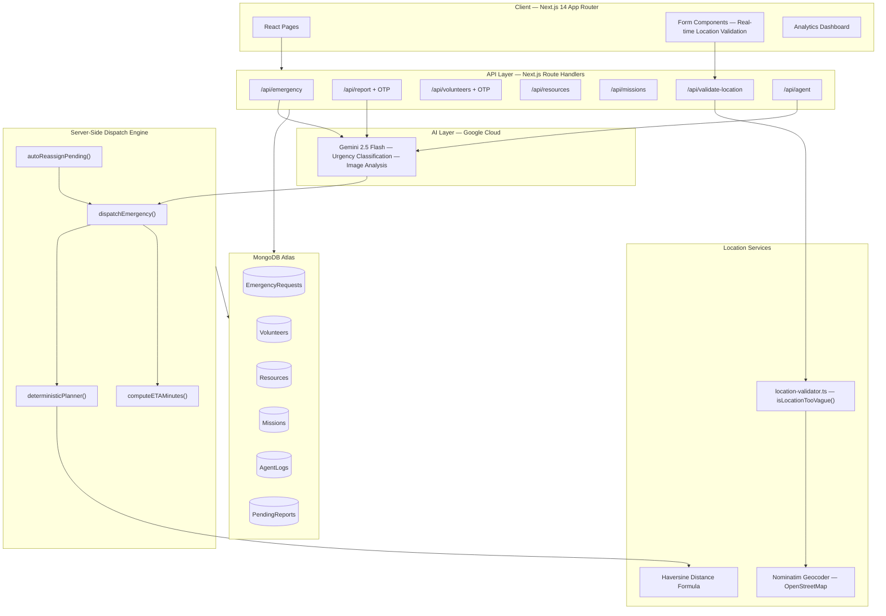
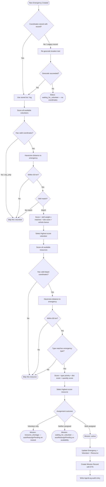

<div align="center">

# 🚨 RescueNet AI

### AI-Powered Disaster Response & Emergency Coordination Platform

[](https://nextjs.org/)
[](https://www.typescriptlang.org/)
[](https://www.mongodb.com/atlas)
[](https://deepmind.google/technologies/gemini/)
[](https://cloud.google.com/)
[](https://tailwindcss.com/)
[](LICENSE)

**Built for the Google Cloud × MongoDB Hackathon**

[Live Demo](#) · [Devpost Submission](#) · [Report a Bug](https://github.com/sibwz/rescuenet/issues) · [Request a Feature](https://github.com/sibwz/rescuenet/issues)

</div>

---

## 📋 Table of Contents

1. [Project Overview](#-project-overview)
2. [Problem Statement](#-problem-statement)
3. [Solution](#-solution)
4. [Key Features](#-key-features)
5. [System Architecture](#-system-architecture)
6. [Distance-Based Dispatch Workflow](#-distance-based-dispatch-workflow)
7. [Technology Stack](#-technology-stack)
8. [Database Design](#-database-design)
9. [Installation Guide](#-installation-guide)
10. [Environment Variables](#-environment-variables)
11. [Running Locally](#-running-locally)
12. [API Routes](#-api-routes)
13. [Future Improvements](#-future-improvements)
14. [Hackathon Compliance](#-hackathon-compliance)
15. [Team](#-team)
16. [License](#-license)

---

## 🌐 Project Overview

**RescueNet AI** is a full-stack emergency coordination platform that uses Google Gemini AI and coordinate-based dispatch logic to automatically connect emergency requests with the nearest available volunteers and resources — without manual dispatcher intervention.

When a disaster strikes, every second matters. RescueNet AI eliminates the coordination bottleneck by running a complete triage-to-dispatch pipeline the moment an emergency is reported: Gemini classifies severity, the location is geocoded and validated, the best-matched volunteer is selected by skill and GPS distance, the closest resource depot is allocated, and a mission record is created — all before the HTTP response returns to the caller.

---

## 🔥 Problem Statement

Traditional disaster response suffers from three critical bottlenecks:

| Problem | Real-World Impact |
|---|---|
| **Manual dispatch** | Coordinators spend 15–45 minutes per incident routing calls and assigning volunteers |
| **No real-time resource visibility** | Depots run out silently; volunteers arrive on scene without supplies |
| **Location ambiguity** | Vague reports ("Lahore", "the city centre") make distance calculations impossible |

In mass-casualty events, these bottlenecks cost lives. A system that automates initial triage and dispatch frees coordinators to focus on complex decisions rather than logistics.

---

## 💡 Solution

RescueNet AI automates the first-response coordination loop end-to-end:

1. **Validate** — Every location is geocoded before any record is saved. Broad inputs like `Karachi` or `Pakistan` are rejected at the API level with a specific, actionable error.
2. **Classify** — Gemini 2.5 Flash reads the incident description and assigns an urgency level (`low` → `critical`) with a written justification the coordinator can read.
3. **Dispatch** — A scoring engine ranks all available volunteers by skill match + Haversine distance, and all resource depots by type match + depot proximity. The top candidates are assigned immediately.
4. **Track** — Missions are created with ETA estimates, volunteer and resource assignments, and a full audit log of every AI and dispatch decision.

Coordinators get a live dashboard to approve volunteer registrations, monitor active missions, and manage resource inventories — with zero manual dispatch required for standard emergencies.

---

## ✨ Key Features

### 🆘 Emergency Management
- Public emergency reporting with OTP verification
- Coordinator-side emergency creation with immediate auto-dispatch
- AI priority scoring (0–100) calculated per request from urgency, type, and people affected
- Gemini-powered urgency classification with written reasoning per incident
- Full status lifecycle: `pending` → `assigned` / `waiting_for_volunteer` / `resource_shortage` → `completed`
- People-affected count directly influences dispatch priority scoring

### 👥 Volunteer Management
- Self-registration with email OTP verification
- Coordinator approval / rejection workflow with a dedicated review panel
- Skills tagging: `medical`, `rescue`, `transport`, `logistics`, `food_distribution`
- Real-time availability status: `available`, `deployed`, `offline`
- Auto-dispatch eligibility enforced — only approved volunteers with geocoded locations are considered
- Active mission details (emergency type, location, ETA, resource) shown per volunteer card

### 📦 Resource Management
- Depot inventory tracking across five resource types: `food`, `water`, `medicine`, `shelter_kits`, `vehicles`
- Quantity-aware allocation — resources are only dispatched if stock is sufficient
- Restock modal with quantity input and reason logging (`Donation received`, `Government supply`, `Purchase`, `Transfer`, `Other`)
- Full audit trail via Agent Logs for every restock and allocation event
- Automatic status promotion to `available` on restock, triggering re-dispatch for waiting emergencies

### 🤖 AI Dispatch Engine
- Gemini 2.5 Flash urgency classification with written reasoning stored per emergency
- Deterministic volunteer scoring: skill match weight + Haversine distance score + vehicle bonus
- Deterministic resource scoring: type priority + depot distance score + quantity score
- Automatic mission creation with volunteer confidence and success probability percentages
- `autoReassignPending` — re-runs dispatch for `waiting_for_volunteer` and `resource_shortage` emergencies whenever a volunteer or resource becomes newly available

### 📍 Location Validation
- Real-time debounced validation on every location input field (700 ms delay)
- Geocoding via Nominatim (OpenStreetMap) — address text → lat/lng
- GPS "Use My Location" button on all forms for instant coordinate capture
- Hard server-side rejection of city-only inputs: `Lahore`, `Karachi`, `Islamabad`, `Pakistan`, and others
- Coordinates stored with every accepted record — the dispatch engine never uses city name strings for distance calculations

### 🗺️ Missions
- Auto-generated on successful dispatch — no manual mission creation required
- ETA calculation based on urgency level and number of people affected
- Volunteer and resource assignment stored and displayed per mission
- Mission completion workflow visible to coordinators
- Full mission history with AI confidence scores

### 📊 Analytics Dashboard
- Live emergency statistics broken down by urgency, status, and type
- Volunteer availability breakdown with deployed / available / offline counts
- Resource inventory summary by category across all depots
- System activity log (Agent Logs) showing every AI classification, dispatch decision, and restock event in chronological order

---

## 🏗️ System Architecture



---


---

## 📐 Distance-Based Dispatch Workflow



---

## 🛠️ Technology Stack

| Layer | Technology | Purpose |
|---|---|---|
| **Framework** | Next.js 14 (App Router) | Full-stack React with co-located server-side API route handlers |
| **Language** | TypeScript 5 | End-to-end type safety across frontend and backend |
| **Database** | MongoDB Atlas | Flexible document store for emergencies, volunteers, resources, missions |
| **ODM** | Mongoose | Schema definition, validation, and type-safe query helpers |
| **AI** | Google Gemini 2.5 Flash | Urgency classification, image analysis, multi-agent planning |
| **Cloud** | Google Cloud (Vertex AI) | Gemini API hosting and authentication |
| **Geocoding** | Nominatim (OpenStreetMap) | Free address → lat/lng conversion |
| **Distance** | Haversine formula (TypeScript) | Accurate great-circle distance between GPS coordinates |
| **Styling** | Tailwind CSS | Utility-first CSS with a custom dark Charcoal + Emerald + Amber theme |
| **Icons** | Lucide React | Consistent, accessible icon set |

---

## 🗄️ Database Design

### `EmergencyRequest`

| Field | Type | Description |
|---|---|---|
| `reporterName` | String | Name of the person reporting the incident |
| `location` | String | Human-readable location label |
| `latitude` / `longitude` | Number | Geocoded coordinates — required for dispatch |
| `locationValidated` | Boolean | `true` only after geocoding passes |
| `emergencyType` | Enum | `medical`, `food`, `water`, `shelter`, `evacuation` |
| `urgency` | Enum | `low`, `medium`, `high`, `critical` |
| `urgency_reason` | String | Gemini's written justification for the urgency level |
| `peopleAffected` | Number | Estimated affected population count |
| `status` | Enum | `pending` → `assigned` / `waiting_for_volunteer` / `resource_shortage` → `completed` |
| `assignedVolunteerName` | String | Populated on successful dispatch |
| `assignedResourceType` | String | Populated on successful dispatch |
| `estimatedETA` | String | Human-readable time-to-arrival estimate |
| `noMatchReason` | String | Explains why dispatch failed, if applicable |

### `Volunteer`

| Field | Type | Description |
|---|---|---|
| `name`, `email`, `phone` | String | Contact details |
| `location` | String | Area label entered during registration |
| `latitude` / `longitude` | Number | Geocoded coordinates |
| `locationPrecision` | Enum | `exact` (GPS), `area` (geocoded), `city_only` (legacy — excluded from dispatch) |
| `skills` | String[] | One or more of: `medical`, `rescue`, `transport`, `logistics`, `food_distribution` |
| `hasVehicle` | Boolean | Used as a tiebreaker in volunteer scoring |
| `status` | Enum | `pending_approval` → `available` / `busy` / `deployed` / `offline` / `rejected` |
| `approved` | Boolean | Set `true` by coordinator action |
| `verifiedEmail` | Boolean | Set `true` after OTP verification |

### `Resource`

| Field | Type | Description |
|---|---|---|
| `resourceType` | Enum | `food`, `water`, `medicine`, `shelter_kits`, `vehicles` |
| `quantity` | Number | Current stock in units |
| `location` | String | Depot area label |
| `latitude` / `longitude` | Number | Geocoded depot coordinates |
| `dispatchEligible` | Boolean | `false` only for legacy records missing coordinates |
| `status` | Enum | `available`, `assigned`, `depleted` |

### `Mission`

| Field | Type | Description |
|---|---|---|
| `emergencyRequest` | ObjectId ref | Linked emergency record |
| `volunteer` | ObjectId ref | Assigned volunteer |
| `resource` | ObjectId ref | Allocated resource depot |
| `status` | Enum | `active`, `awaiting_volunteer`, `resource_shortage`, `completed` |
| `volunteerConfidence` | Number | Dispatch scoring confidence (0–100) |
| `missionSuccessProbability` | Number | AI-estimated outcome probability |
| `estimatedETA` | String | Time-to-arrival estimate |

### `AgentLog`

| Field | Type | Description |
|---|---|---|
| `action` | String | e.g. `EMERGENCY_SUBMITTED`, `DISPATCH_SUCCESS`, `RESOURCE_RESTOCK`, `AUTO_REASSIGN_SUCCESS` |
| `details` | String | Full human-readable audit entry |
| `relatedIds` | ObjectId[] | References to all documents affected by this event |
| `createdAt` | Date | Timestamp — indexed for chronological display |

---

## 🚀 Installation Guide

### Prerequisites

- **Node.js** 18.x or higher
- **npm** or **yarn**
- **MongoDB Atlas** account (free M0 tier is sufficient)
- **Google Cloud** project with the Vertex AI API enabled and Gemini access

### 1. Clone the Repository

```bash
git clone https://github.com/sibwz/rescuenet.git
cd rescuenet
```

### 2. Install Dependencies

```bash
npm install
```

### 3. Configure Environment Variables

See the [Environment Variables](#-environment-variables) section below.

### 4. Run the Development Server

```bash
npm run dev
```

Open [http://localhost:3000](http://localhost:3000) in your browser.

---

## 🔐 Environment Variables

Create a `.env.local` file in the project root with the following values:

```env
# ── MongoDB Atlas ──────────────────────────────────────────────────────────────
MONGODB_URI=mongodb+srv://<username>:<password>@<cluster>.mongodb.net/<dbname>?retryWrites=true&w=majority

# ── Google Cloud / Gemini ──────────────────────────────────────────────────────
GOOGLE_CLOUD_PROJECT=your-gcp-project-id
GOOGLE_CLOUD_LOCATION=us-central1
# Model ID for Gemini 2.5 Flash Preview
GEMINI_MODEL=gemini-2.5-flash-preview-05-20

# ── Application ────────────────────────────────────────────────────────────────
NEXT_PUBLIC_APP_URL=http://localhost:3000

# ── OTP Verification ───────────────────────────────────────────────────────────
# Random secret used to sign and verify OTP sessions
OTP_SECRET=replace-with-a-long-random-string
```

> **Google Cloud Authentication**
>
> For local development, authenticate with Application Default Credentials:
> ```bash
> gcloud auth application-default login
> ```
> For production / CI, set the `GOOGLE_APPLICATION_CREDENTIALS` environment variable pointing to a service account key JSON file with the **Vertex AI User** role.

---

## ▶️ Running Locally

```bash
# Start the Next.js development server with hot reload
npm run dev

# Type-check without emitting — useful for CI
npx tsc --noEmit

# Build an optimised production bundle
npm run build

# Start the production server after building
npm start
```

---

## 🔌 API Routes

### Emergency Requests

| Method | Endpoint | Description |
|---|---|---|
| `GET` | `/api/emergency` | List all emergency requests |
| `POST` | `/api/emergency` | Create an emergency (validates location, triggers auto-dispatch) |
| `PUT` | `/api/emergency/[id]` | Update an emergency request |
| `DELETE` | `/api/emergency/[id]` | Delete an emergency request |
| `POST` | `/api/emergency/[id]/approve` | Coordinator approves a recommended mission |
| `DELETE` | `/api/emergency/cleanup` | Remove demo-seeded records |

### Public Emergency Reporting (OTP-Verified)

| Method | Endpoint | Description |
|---|---|---|
| `POST` | `/api/report/send-otp` | Generate a verification code for the reporter |
| `POST` | `/api/report/verify-otp` | Verify code and finalize report submission + dispatch |

### Volunteers

| Method | Endpoint | Description |
|---|---|---|
| `GET` | `/api/volunteers` | List volunteers with active mission details |
| `POST` | `/api/volunteers` | Register a new volunteer (initiates OTP flow) |
| `PUT` | `/api/volunteers/[id]` | Update status, approve, or reject |
| `DELETE` | `/api/volunteers/[id]` | Remove a volunteer record |
| `POST` | `/api/volunteers/send-otp` | Send email OTP for verification |
| `POST` | `/api/volunteers/verify-otp` | Verify OTP and activate volunteer |

### Resources

| Method | Endpoint | Description |
|---|---|---|
| `GET` | `/api/resources` | List all resource depots |
| `POST` | `/api/resources` | Add a depot (validates location, stores coordinates) |
| `PUT` | `/api/resources/[id]` | Update status or restock `{ restock: { add, reason } }` |
| `DELETE` | `/api/resources/[id]` | Remove a depot |

### Missions

| Method | Endpoint | Description |
|---|---|---|
| `GET` | `/api/missions` | List all missions (populated with volunteer + resource) |
| `PUT` | `/api/missions/[id]` | Update mission status (e.g. mark completed) |

### Utilities

| Method | Endpoint | Description |
|---|---|---|
| `POST` | `/api/validate-location` | Geocode a location string; returns `valid`, `lat`, `lng`, `tooVague` |
| `GET` | `/api/reverse-geocode` | Convert `?lat=&lng=` to a place name string |
| `POST` | `/api/agent` | Run the multi-agent AI planning pipeline |
| `POST` | `/api/demo` | Seed demonstration data |
| `POST` | `/api/admin/cleanup-demo` | Remove all demo-seeded records |

---


## 🔮 Future Improvements

| Feature | Description |
|---|---|
| **SMS / Push Alerts** | Notify dispatched volunteers instantly via SMS (Twilio) or push notification |
| **Real-time Updates** | Replace polling with WebSockets or SSE for a truly live dashboard |
| **Interactive Map View** | Visualise emergency locations, volunteer positions, and depots on a map |
| **Mobile Companion App** | React Native app for field volunteers to accept missions and update status |
| **Multi-organisation Tenancy** | Isolate data per NGO so multiple organisations can share the platform |
| **Predictive Pre-positioning** | Gemini-powered demand forecasting to suggest where to stage resources before disasters strike |
| **Optimal Route Planning** | Multi-stop routing for vehicles delivering to several affected areas |
| **Volunteer Training Profiles** | Track certifications, training hours, and past mission history alongside skills |
| **Offline-first Mode** | Service worker caching so field coordinators can read data in low-connectivity zones |

---

## 🏆 Hackathon Compliance

### Google Cloud × MongoDB Hackathon Requirements

| Requirement | How RescueNet AI Meets It |
|---|---|
| **Google Cloud integration** | Vertex AI SDK used server-side to call Gemini 2.5 Flash for urgency classification, image analysis, and multi-agent planning |
| **MongoDB Atlas integration** | All persistent data stored in MongoDB Atlas; Mongoose ODM provides typed schemas and query helpers |
| **Meaningful AI / ML usage** | AI drives the entire triage pipeline — not a wrapper around a chatbot |
| **Real-world impact** | Addresses disaster response coordination, a proven humanitarian bottleneck |
| **Full-stack application** | Next.js 14 App Router: React frontend + server-side API routes + background dispatch jobs |
| **Original work** | Built from scratch for this hackathon |

### How Gemini 2.5 Flash Is Used

| Use Case | Implementation |
|---|---|
| **Urgency classification** | Reads incident `description`, `emergencyType`, and `peopleAffected`; returns `low / medium / high / critical` with a written reasoning sentence stored per emergency |
| **Image analysis** | Analyses uploaded disaster photos to detect disaster type, severity, estimated people affected, and recommended resource types |
| **Multi-agent planning** | `/api/agent` runs a structured reasoning pipeline that returns volunteer and resource allocation plans with detailed justification per decision |

### Why MongoDB Atlas

- Document model matches emergency data naturally — each request embeds coordinates, status history, and assignment in one document
- Flexible schema supports iterative feature additions without costly migrations
- Geospatial-ready structure: `latitude` / `longitude` stored per document, ready for `$geoNear` queries in future
- Atlas free tier (M0) fully supports the dataset required for hackathon demonstration

---

## 👥 Team

| Name | Role |
|---|---|
| **Amar** | Full-stack Development · AI Integration · System Architecture |

---

## 📄 License

This project is licensed under the **MIT License** — see the [LICENSE](LICENSE) file for details.

---

<div align="center">

**Built with care for the Google Cloud × MongoDB Hackathon**

> *RescueNet AI — When every second counts, automation saves lives.*

</div>
